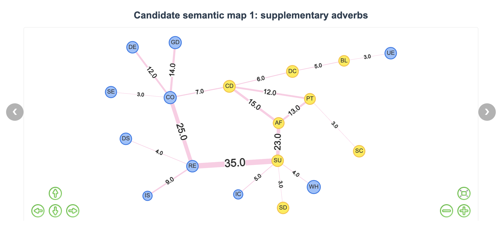

# XISM: eXplanatory-Interactive Semantic Map    
  

XISM is a web-based semantic map generation tool that allows users to upload Excel files (form-function correspondence tables) to generate interactive semantic maps, supporting real-time editing and exporting images.  

<h4 align="center">
    <p>
        <a href="#-prerequisites">🤖 Prerequisites</a> |
        <a href="#-installation-steps">📦 Installation</a> |
        <a href="#-run-the-system">🚀 run</a> |
        <a href="#-user-guide">🪄 guide</a> |
        <a href="#-contact">📮 contact</a>
    <p>
</h4> 

## 🤖 Prerequisites

Before getting started, make sure your system has:

- **Python 3.10+**
- **pip** (Python package manager)
- **Git**

## 📦 Installation Steps

### 1. Clone the Repository
```bash
git clone https://github.com/hank317/XISM.git
cd XISM
```

### 2. Install Dependencies
```bash
pip install -r requirements.txt
```

## 🚀 Run the system
First, you need to specify the port number on which the entire service will run. By default, it is set to 5086, and you can modify the port in the utils.py file:
```python
port = your_local_port
``` 
Run the app.py file just like you would run any other Python script:
```bash
python app.py
``` 


## 🪄 User Guide
For more detailed instructions, please refer to the help functionality.

### 1. Upload Excel File  

In the **Upload Excel File** module, click the **Choose File** button to upload the corresponding Excel file. Then click the **Upload and Generate Graph** button on the right to complete the file upload.  
 
### 2. Graph Demonstration  

The middle area displays multiple graphs, which are generated by the algorithm. Each graph includes an evaluation below.  

### 3. Graph Controls  

The **Graph Controls** module provides several functional buttons for interactive operations:  
 
### 4. Evaluation Metrics  

Map evaluation includes the following eight metrics:  

- **Weight Sum**: The sum of edge weights.  
- **Degree Mean**: The average degree of nodes in the graph.  
- **Degree Std**: The standard deviation of node degrees. 
- **Coverage**: The coverage of connected forms among all existing forms.  
- **Productivity**: The proportion of actual forms among all possible forms. 
- **Accuracy**: The degree of alignment with expert annotations.  
- **Precision**: The proportion of predicted edges that match the ground truth.
- **Recall**: The proportion of ground truth edges that are correctly predicted.
- **F1 Score**: The geometric mean of Precision and Recall. 
- **Unconnected Forms**: Forms in the current graph that are not connected, helping users adjust the graph.   
 
### 5. Image Save  

After adjusting the graph, users can save it. Click the **Download Image** button to download the current semantic map. 


## 📮 contact
- email : liuzhu22@mails.tsinghua.edu.cn  

